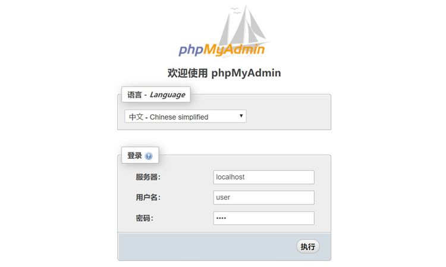

PMA Desktop: 绿色单文件的PhpMyAdmin桌面版
==============================================

本软件为绿色单文件软件，目前仅支持Win，后续支持 Linux 和 Mac

PMA DeskTop主页： <https://github.com/pubxun/PMA-Desktop>

项目目标
--
不用配置PHP环境，使PhpMyAdmin更方便的被桌面用户使用，使其能与Navicat使用一样方便

近期TODO
--
自动升级模块

效果图：

运行方式
--

下载 Release 中的 pma-desktop.exe 双击运行， 稍等片刻（初次加载可能会有5-10秒延迟，请耐心等待）， 出来黑色的命令行窗口即可

然后访问浏览器  localhost:88  即可看到熟悉的 phpmyadmin 界面

关闭方法：
直接关闭黑色的命令行即可

升级方法：
--

直接覆盖即可

用户交流群
--

QQ群号 628531107

